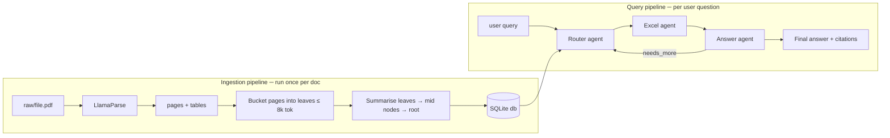
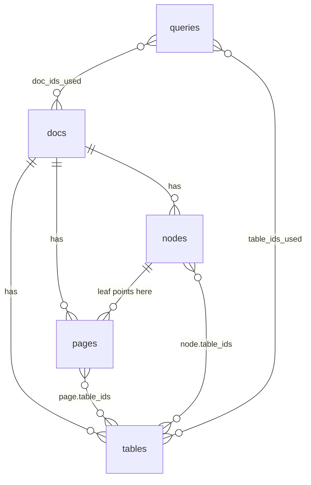
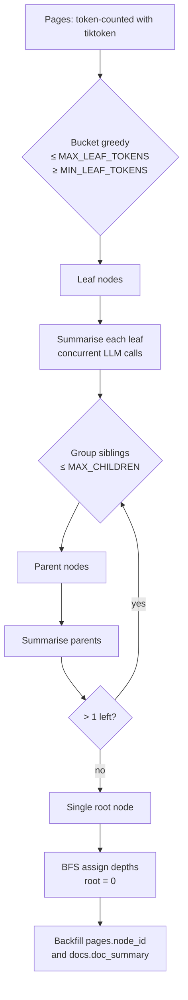
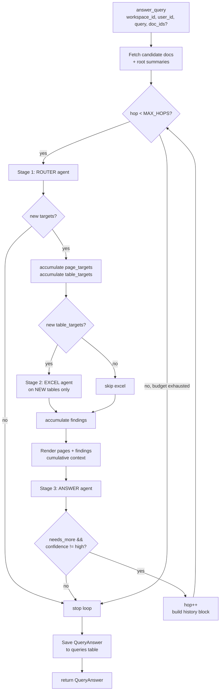

# Doc Reasoner — Full Agent Flow

End-to-end spec of how a document goes from a PDF in `raw/` to a grounded answer for a user query.

---

## 1. Overview

The system has two pipelines:

1. **Ingestion** — runs once per document. Parses, summarises, and indexes.
2. **Query** — runs per user question. Multi-stage agentic loop with hard recall + tabular reasoning.



Everything is grounded in a structured `nodes` tree built at ingest, so the query pipeline never has to scan raw text — it walks summaries top-down and only fetches pages once it knows where to look.

---

## 2. Data layer

SQLite via SQLAlchemy + Alembic migrations. Single workspace can hold many docs; each doc owns a tree of nodes plus its pages and tables.



| Table | Key fields | Purpose |
|-------|-----------|---------|
| `docs` | `doc_id`, `workspace_id`, `title`, `n_pages`, `doc_summary` | One row per uploaded doc |
| `pages` | `(doc_id, page_n)`, `prose_text`, `table_ids`, `node_id` | One row per page; `node_id` points to its leaf node |
| `tables` | `table_id`, `doc_id`, `source_page`, `xlsx_bytes`, `row_count` | Each extracted table; xlsx stored as bytes (`LargeBinary` → `BYTEA` on Postgres) |
| `nodes` | `node_id`, `doc_id`, `parent_id`, `depth`, `start_page`, `end_page`, `summary`, `child_ids`, `table_ids` | Hierarchical index over the doc |
| `queries` | `query_id`, `query_text`, `answer`, `citations_json`, `doc_ids_used`, `table_ids_used`, `latency_ms` | Audit log of every answered query |

Models live in `db/models/models.py`. All CRUD helpers in `db/utils.py`.

---

## 3. Ingestion pipeline

### 3.1 Parse (LlamaParse)

`parsing.py` calls `llama-cloud-services` with `parse_page_with_agent` + table-friendly options. For each page it gets back markdown prose; for each detected table it gets back rows that we serialise to an xlsx via openpyxl.

Each ingested doc populates:
- One `docs` row
- `n_pages` × `pages` rows (markdown + linked `table_ids`)
- `n_tables` × `tables` rows (with `xlsx_bytes`)

### 3.2 Tree build (`tree.py`)

Greedy bucketing of pages into **leaf nodes**, then upward summarisation:



Knobs (all in `.env`):

| Var | Default | What it does |
|-----|---------|--------------|
| `TREE_MAX_LEAF_TOKENS` | 8000 | Stop adding pages to a leaf at this ceiling |
| `TREE_MIN_LEAF_TOKENS` | 4000 | Tail leaves below this get merged into the previous one |
| `TREE_MAX_CHILDREN` | 6 | Max children per parent before splitting |
| `TREE_CONCURRENCY` | 30 | Parallel LLM summarisation calls per level |

Each summary follows a structured template (Overview / Key Facts / Tables / Entities / Connections) so it's optimised for *routing* downstream, not for human reading.

### 3.3 Driver script

`scripts/build_nodes.py` runs `build_tree()` for every doc that doesn't yet have nodes. Idempotent.

---

## 4. Query pipeline

The heart of the system. Lives in `agent.py`. Multi-hop loop coordinated by `answer_query()`:



### 4.1 Stage 0 — candidate docs

`answer_query()` selects `docs` rows for the workspace (filtered by `doc_ids` if supplied). Each candidate's `doc_summary` (root-node summary, written at ingest time) is inlined in the router's first prompt — no extra LLM call to "list docs".

### 4.2 Stage 1 — Router agent

Pydantic-AI `Agent[RouterDeps, RouterResult]`. Walks the node tree top-down. **Optimises for recall** while respecting a tool-call budget.

**Tools available:**

| Tool | What it returns | When the LLM uses it |
|------|-----------------|----------------------|
| `expand_doc(doc_id)` | depth-1 sections of a doc | Always once per relevant doc |
| `expand_node(node_id)` | children of a non-leaf node | When a section is too broad |
| `peek_node(node_id)` | full summary of one node | When a brief is ambiguous |
| `list_doc_tables(doc_id)` | all tables in a doc (id, source page, columns) | When query is numeric / tabular |
| `peek_table(table_id)` | column schema + first 5 rows | To confirm a table matches |

**Hard guards in `RouterDeps`:**

- `_known_leaves: set[str]` — tracks every node identified as a leaf. `expand_node` on a leaf is **rejected** with a strong message ("use it as a page_target directly").
- `_expanded_nodes: set[str]` — refuses re-expanding the same node twice.
- `already_picked_pages` / `already_picked_tables` (for multi-hop) — see §4.5.

These guards are defense-in-depth against the LLM ignoring system-prompt rules.

**Output schema:**

```python
class RouterResult(BaseModel):
    page_targets: list[PageTarget]    # narrative answers
    table_targets: list[TableTarget]  # tabular reasoning
    reasoning: str

class PageTarget(BaseModel):
    doc_id: str
    start_page: int
    end_page: int
    reason: str

class TableTarget(BaseModel):
    doc_id: str
    table_id: str
    reason: str
```

**Budget:** `AGENT_ROUTER_REQUEST_LIMIT` (default 60) via `pydantic_ai.UsageLimits`. System prompt also instructs "~30 total tool calls, 3–6 total targets, max 2 levels deep".

### 4.3 Stage 2 — Excel agent

Runs **only if the router emitted at least one `table_target`**. Pydantic-AI `Agent[ExcelDeps, ExcelResult]`.

For each picked table, `xlsx_bytes` from the DB is loaded into a pandas DataFrame, keyed by `table_id`. Agent gets two tools:

| Tool | What it does |
|------|--------------|
| `describe_table(table_id)` | Columns, dtypes, shape, first 5 rows |
| `run_pandas(table_id, code)` | `eval(code, {"pd": pd, "df": df, "__builtins__": SAFE_BUILTINS}, {})` |

**Sandbox security:**

- 27 safe builtins (`int`, `float`, `str`, `len`, `sum`, `sorted`, etc.) — enough for type casts and iteration.
- Forbidden tokens checked before eval: `import `, `open(`, `exec(`, `eval(`, `__`.
- Statements (assignments) get a clean error guiding the agent to use expressions.

**Output:**

```python
class ExcelResult(BaseModel):
    findings: list[TableFinding]   # one per relevant table
    notes: str                     # caveats, ambiguities

class TableFinding(BaseModel):
    table_id: str
    doc_id: str
    finding: str   # e.g. "Top 3 OEMs: Maruti 41.8%, Hyundai 14.6%, Tata 13.6%"
```

Findings flow into the answer agent as a structured block, so the answer agent never has to estimate numbers from markdown — they're already computed.

### 4.4 Stage 3 — Answer agent

Pydantic-AI `Agent[None, AnswerResult]`. No tools; single shot. Receives:

- The user query.
- All page content rendered as markdown (with inline tables for context, but the *authoritative* numbers come from the Excel findings block below).
- The Excel agent's `TableFinding`s rendered as a separate block.

**Output schema:**

```python
class AnswerResult(BaseModel):
    answer: str
    citations: list[Citation]
    confidence: Literal["high", "medium", "low"]
    needs_more: bool                    # multi-hop signal
    follow_up_question: str | None      # precise gap to fill if needs_more
```

The `needs_more` / `follow_up_question` pair drives the multi-hop loop.

### 4.5 Multi-hop loop control

The orchestrator accumulates state across hops:

```python
acc_page_targets:   list[PageTarget]    # ever-growing
acc_table_targets:  list[TableTarget]
acc_table_findings: list[TableFinding]
acc_pages_picked:   set[str]            # "{doc_id}:{start}-{end}"
acc_tables_picked:  set[str]            # table_ids
hops:               list[HopTrace]
```

On hop `n > 0`, the router prompt is extended with a **history block**:

```
## Previously explored — DO NOT re-pick these:
- doc_X, pages 28-37  reason: ...
- table tbl_abc       reason: ...

## What was found in previous hop(s):
- Table tbl_abc: PLI auto = ₹751.4 bn
- Table tbl_xyz: HDFC green pool = ₹671.1 bn (insufficient)

## What's still missing (from the answer agent):
{ans.follow_up_question}

Your job this round: find DIFFERENT pages/tables addressing the missing info.
```

The router's `RouterDeps.already_picked_pages` / `already_picked_tables` also enforce dedup at the tool level (defense in depth).

**Loop termination — any of:**

1. `confidence == 'high'`
2. `needs_more == False`
3. Router emits zero new targets (no novel routes)
4. `hop_count >= AGENT_MAX_HOPS` (default 3)

**Per-hop cost optimisation:**

- Excel agent is only called when there are NEW table targets that hop.
- Answer agent runs **every hop** — it both produces the answer and emits the `needs_more` decision in the same call. No separate critic step.
- Pages already rendered are reused; only new pages are fetched and rendered for added content.

### 4.6 Final return

```python
class QueryAnswer(BaseModel):
    query_id: str
    query: str
    page_targets: list[PageTarget]      # cumulative across hops
    table_targets: list[TableTarget]
    table_findings: list[TableFinding]
    answer: str                         # from last hop
    confidence: str                     # from last hop
    citations: list[Citation]
    latency_ms: int
    n_hops: int
    hops: list[HopTrace]                # full per-hop trace
```

Persisted to the `queries` table for audit.

---

## 5. File layout

```
doc-reasoner-manus/
├── config.py                 # pydantic-settings, .env-driven
├── shared.py                 # shared utilities (logging, SSE helpers)
├── parsing.py                # LlamaParse wrapper + xlsx writer
├── tree.py                   # bucket + summarise → nodes
├── agent.py                  # Router + Excel + Answer + orchestrator
├── agent_schemas.py          # Pydantic output schemas (PageTarget, QueryAnswer, …)
├── report.py                 # Report drafting pipeline
├── report_schemas.py         # Pydantic schemas for report pipeline
├── api/
│   ├── app.py                # FastAPI app, lifespan, middleware
│   ├── auth.py               # static bearer-token auth
│   ├── events.py             # EventBus / EventChannel / EventSink
│   ├── ingest.py             # async ingest worker queue
│   ├── schemas.py            # API request/response schemas
│   └── routes/
│       ├── health.py         # GET /healthz
│       ├── documents.py      # document CRUD + upload + SSE
│       ├── queries.py        # query CRUD + SSE
│       └── reports.py        # report CRUD + SSE
├── db/
│   ├── base.py               # DeclarativeBase
│   ├── session.py            # engine + SessionLocal + get_db
│   ├── utils.py              # all CRUD helpers (one file)
│   └── models/
│       └── models.py         # all 6 ORM models
├── alembic/                  # migrations
├── scripts/
│   ├── build_nodes.py        # ingest helper — build trees
│   ├── ask.py                # CLI query: `python scripts/ask.py "..."`
│   └── draft.py              # CLI report: `python scripts/draft.py "..."`
├── data/
│   ├── app.db                # SQLite
│   └── uploads/              # uploaded documents
├── .env / .env.example
├── requirements.txt
├── Dockerfile
└── docker-compose.yml
```

---

## 6. Config reference (`.env`)

| Section | Var | Default | Notes |
|---------|-----|---------|-------|
| **Database** | `DATABASE_URL` | `sqlite:///./data/app.db` | Swap to `postgresql+psycopg://...` later |
| **LLM** | `OPENAI_API_KEY` | — | Any OpenAI-compatible endpoint |
| | `OPENAI_BASE_URL` | `https://api.openai.com/v1` | e.g. Dashscope for Qwen |
| | `OPENAI_MODEL` | `gpt-4o` | Currently `qwen3.6-flash` |
| **Parsing** | `LLAMA_PARSE_KEY` | — | LlamaCloud key |
| **Tree** | `TREE_MAX_LEAF_TOKENS` | 8000 | Bucket ceiling |
| | `TREE_MIN_LEAF_TOKENS` | 4000 | Tail-merge threshold |
| | `TREE_MAX_CHILDREN` | 6 | Children per parent |
| | `TREE_CONCURRENCY` | 30 | Parallel summarisation calls |
| **Agents** | `AGENT_ROUTER_REQUEST_LIMIT` | 60 | pydantic-ai requests per router run |
| | `AGENT_EXCEL_REQUEST_LIMIT` | 40 | per excel run |
| | `AGENT_ANSWER_REQUEST_LIMIT` | 10 | per answer run |
| | `AGENT_MAX_HOPS` | 3 | Hard ceiling on router→answer iterations |

---

## 7. CLI usage

```bash
# Ingest documents (drop into raw/ first, then run)
python scripts/build_nodes.py

# Ask a question
python scripts/ask.py "your question here"

# Restrict to specific docs
python scripts/ask.py --docs doc_14b0f97d69b5 "..."

# Verbose — show per-hop routing + findings
python scripts/ask.py -v "..."
```

---

## 8. Why this shape vs. naïve RAG

| Naïve RAG | This system |
|-----------|-------------|
| Chunk all pages, embed, top-k retrieve | Pre-built tree of summaries — LLM-routed |
| Tables get flattened into prose chunks | Tables stay structured; pandas-evaluated separately |
| One-shot retrieve → answer | Multi-hop with `needs_more` signal |
| Recall depends on embedding quality | Recall depends on summary quality (LLM-curated at ingest) |
| Numeric answers estimated from text | Numeric answers **computed** via pandas |
| No cross-doc reasoning structure | Each doc's tree is queried; results aggregated |
| ~all pages touched at query time | Typically 5–25 pages touched per query |

---

## 9. Future work (not in v1)

- **Streaming** per-hop output to the caller (currently we only return when done)
- **Parallel router** for very large workspaces (10+ docs)
- **Cross-table joins** in the Excel agent (currently per-table only)
- **Embedding fallback** for queries the router can't route confidently
- **Workspace-level cache** of recurring queries
- **Production**: swap SQLite → Postgres; the only change needed is `DATABASE_URL`
